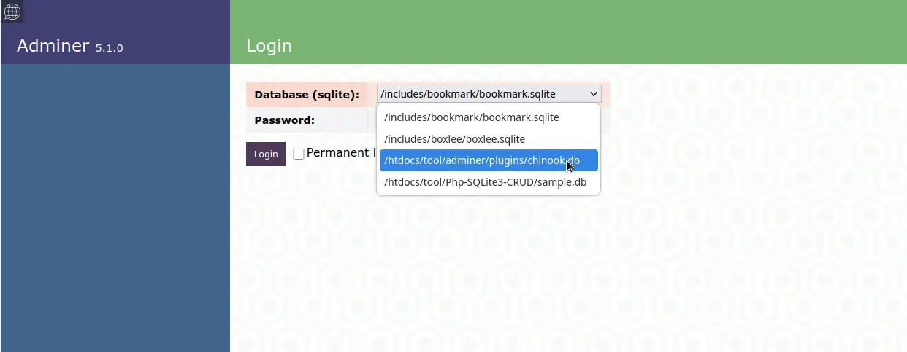

# Adminer SQLite Plugin

This plugin enhances **[Adminer](https://www.adminer.org/)** by simplifying the login process for SQLite databases. Instead of the standard login form, users only need to select a SQLite database and enter a password.

## Features

- **Simplified Login**: works out of the box, for demonstration [adminer.php](https://github.com/vrana/adminer/releases/download/v5.1.0/adminer-5.1.0.php) (V 5.10.0) is included as well. Feel free to get newest version.
- **Password Protection**: Stores the hashed password securely in `CSqlite.pwd`.
- **Automatic Database Detection**: Recursively scans a specified directory for `*.sqlite` or `*.db` files.

## Installation

1. **Upload Adminer & Plugin**: Copy the files to your web server directory.
2. **Adjust Configuration**:
   - Set the database directory in `CSqlite.php`:
     ```php
     $vPath = "/var/www/global"; // Set your desired path here
     ```
3. **Set File Permissions**:
   Ensure the web server has write access to the plugins directory (use your path):
   ```sh
   chmod 775 /var/www/global/htdocs/adminer/plugins
   chown www-data:www-data /var/www/global/htdocs/adminer/plugins
   ```

## Password Management

- Password of sample password file `CSqlite.pwd`  is 12345678
- To change the password, delete `CSqlite.pwd` and log in with a new password.
- On first login, the entered password is encrypted and saved in `CSqlite.pwd`.

## Theme

- As an example the design lucas-sandery is applied
- Delete adminer.css to get the default desing
- Or replace it with another design [listed here](https://www.adminer.org/)

## Usage

1. Open Adminer with the plugin in your browser. https://[domain/path]/adminer/sqlite.php

  

2. Select a database from the list.

  


3. Enter the password. Password will be saved first time after deleting CSqlite.pwd

4. Login!

  


## Note

- If no databases are found, check the path setting in `CSqlite.php` and file permissions.
- Call to https://[domain/path]/adminer/adminer.php opens unchanged adminer version
- You might want to set a symlink index.php

## License

MIT License

